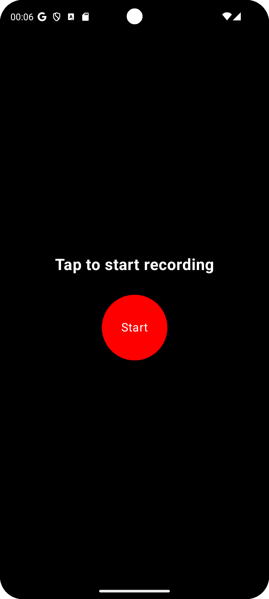

# Speech to Text Android App

> 🤖 This project was entirely developed by AI (Claude 3.5 Sonnet) in an interactive pair programming session.

A HAL 9000-inspired Android app that records speech, converts it to text using Android's built-in speech recognition, and sends the text along with a PIN to a specified endpoint.

<div align="left">
  
  
</div>

## Features

- Modern, HAL 9000-inspired UI with a pulsating red recording button
- PIN entry requirement before recording
- Dual language support (German/English) for speech recognition
- Real-time speech-to-text conversion
- Automatic recording stop on speech pause
- Gesture-based navigation (swipe up to quit)
- Sends converted text and PIN to a REST endpoint
- Permission handling for microphone access

## Setup

1. Clone the repository
2. Open the project in Android Studio
3. Build and run the app on your device or emulator

## Usage

1. Launch the app
2. Enter your 6-digit PIN
3. After PIN entry, tap the red button to start recording
4. Speak in German or English
5. The app will automatically stop recording when you pause speaking
6. The recognized text will be displayed and sent to the server along with your PIN
7. Swipe up anywhere on the screen to quit the app

## Technical Details

- Built with Jetpack Compose for modern UI
- Uses Android's SpeechRecognizer API for speech recognition
- Supports both German and English speech recognition
- Implements modern gesture-based navigation
- Uses OkHttp for network communication
- Material3 design components
- Dark theme optimized

## Requirements

- Android Studio Hedgehog or newer
- Android SDK 26 or higher (Android 8.0+)
- Kotlin 1.9.22 or higher

## Configuration

The REST endpoint URL is configured in `MainActivity.kt`. By default, it sends the text and PIN to `http://192.168.1.1:8000/type` in the following JSON format:

```json
{
  "text": "recognized speech text",
  "pin": "entered PIN"
}
``` 
